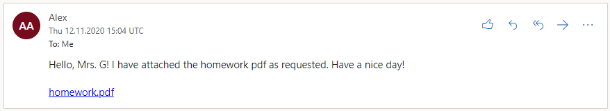
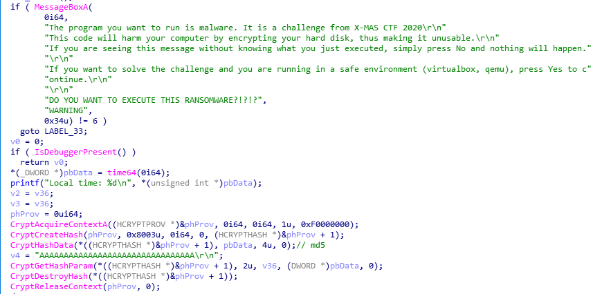
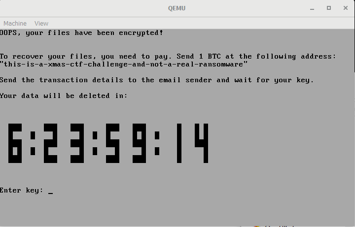
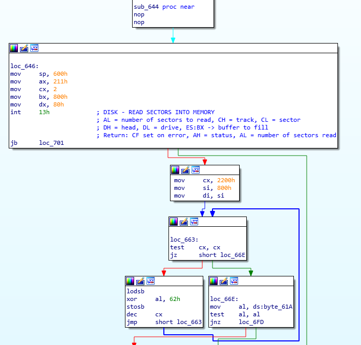
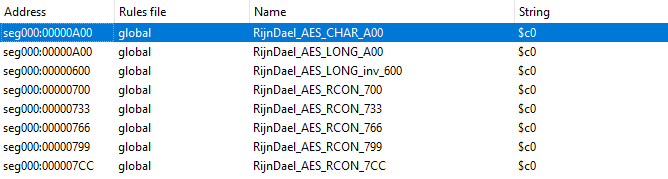
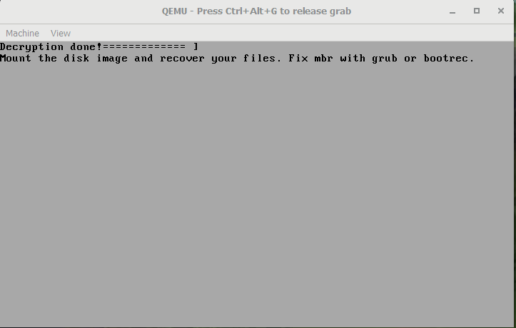
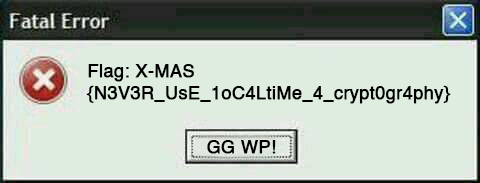

>Hello, reverse engineer! We have a task for you!
>Mrs. G, a well known teacher at the University received an email from an evil human being pretending to be
one of her students. This email was supposed to contain the scanned homework assignment in PDF file format.
>However, when opening the PDF, Mrs. G was prompted with an User Account Control dialog box. In a hurry (she
had over 100 assignments to grade) she pressed yes, thinking it was just another windows update.
>
>When she restarted her PC a few minutes later, instructions telling an update was in progress popped up.
>However, after the update progress bar reached 100%, a strange message with a counter was on the screen. The
text requested a ransom to access the files on the PC.
>
>To prevent further damage to the data a disk image was created.
>
>You are given this disk image, the original “homework” pdf and the email. Can you recover the data and save
the day? The reward will be substantial!
>
>P.S. This challenge contains LIVE MALWARE. Be extremely careful if you decide to run it on your computer. The malware should technically be deactivated, but we still aren’t liable if anything goes wrong by accidentally running it. You have been warned!
The zip password is “xmasctf” without quotes.

In this challenge, we are given 3 files: `disk_image.vhd`, `homework.pdf` and `mail.png`

Looking at the `mail.png` we can we see the message that the teacher recieved before got infected.



Remember the date (12.11.2020 utc), this will come in handy later.

The `homework.pdf` file is actually an executable with `pdf` icon.
Openning it in IDA we can see that it is packed by `upx`, so we have
to unpack it first. The unpacking process is rather simple, we rename
secontions to `upx0` and `upx1` and use standard tool to unpack it.

Looking at the ransomware main functionality we can see that:

1) it gets md5 hash of a current time
2) it sends this hash to `oiw4gi4acmxkbcce.onion.pet`
3) it loads new `MBR` from resources
4) it replaces original MBR with malicious one



The hash is padded with `0xEB` `0x0F`:

```c++
printf("Generated key: EB:0F:");
do
{
    v14 = *md5_of_timestamp++;
    printf("%02x:", v14);
}
while ( v2 != (BYTE *)&v37 );
printf("\n");
```

After that the key is copied into malicious mbr at some offset:
`qmemcpy((char *)&mbr->m128i_i64[1] + 4, &key, 14ui64);`

Let’s check out malicious mbr now. I will use qemu for this.

```
qemu-system-i386 -drive format=raw,file=disk_image.vhd
```



Pretty scary huh. Our goal now is to find what type of encryption it uses and can we break it.

Lets open it in our favorite disassembler:
Looking at the entrypoint we see that it copies itself to `0x600` and then jumps to `0x644`.
After that, it loads its main payload from disk, decrypts it and jumps to it:



The actual fun stuff happens at `0x24AD`, this function handles key presses, printing to the screen and decryption.

It is a good practise to use `findcrypt` plugin when analyzing ransomware. This time it found `AES` constants.



So I think it is sufficient to say what type of encryption it uses. Now we have to find a key.

The function at `0x272A` checks if key is correct by decrypting 16 bytes of data and comparing it to `AAAAAAAAAAAAAAAA`.

Since we know the time when the teacher recieved message, we can bruteforce timestamp and find correct key.

```python
from hashlib import md5
from Crypto.Cipher import AES
from struct import pack
from binascii import hexlify

def find_key():
  data = b'\x33\x09\xCF\x6E\x53\xAE\x8A\x1F\x58\x40\xA4\x2D\x26\x4A\x18\xBF'
  timestamp = 1605193200 # 12.11.2020 15:00 utc
  for i in range(timestamp, timestamp + 20000):
    hash = bytearray(md5(pack('<I', i)).digest())
    hash = b'\xEB\x0F' + hash[:-2]
    aes  = AES.new(hash, AES.MODE_ECB)
    dec  = aes.decrypt(data)
    if dec == b'AAAAAAAAAAAAAAAA':
      print('time: {}\nkey: {}'.format(i, hexlify(hash)))

find_key()
```

And we sure find a correct key:

```
time: 1605193524
key: b'eb0f6661f1973d10ed31eeda28f05710'
```

Let’s enter it:



I could not find a good way to mount this image, so I used PhotoRec` to extract files.

Between all the files there was an image with the flag:



P.S. U could start qemu with `-s -S` flags and connect to it with the debugger. It took me several tries to understand how key is handled and if there is something more than just AES.

---

The end :)

