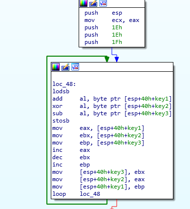

# Smol

>Однажды Эрнест Хемингуэй поспорил, что напишет самый короткий рассказ, способный растрогать любого.
>Проверь сам, всего 228 байт!

## Описание

Нам дан 32-битный эльф размером 228 байт. Попробовал открыть в Иде или любом другом дизассемблере, мы встречаем ряд интересных ошибок:


В итоге Иде не получается загрузить наш файл и она умирает в агониях.

Что же тут происходит?

Посмотрим на вывод команды `readelf`:

```
$ readelf -a Smol
ELF Header:
  Magic:   7f 45 4c 46 01 00 00 00 00 00 00 00 00 00 01 00
  Class:                             ELF32
  Data:                              none
  Version:                           0
  OS/ABI:                            UNIX - System V
  ABI Version:                       0
  Type:                              EXEC (Executable file)
  Machine:                           Intel 80386
  Version:                           0x10020
  Entry point address:               0x10020
  Start of program headers:          4 (bytes into file)
  Start of section headers:          2201010819 (bytes into file)
  Flags:                             0x6eb30ec
  Size of this header:               52 (bytes)
  Size of program headers:           32 (bytes)
  Number of program headers:         1
  Size of section headers:           3213 (bytes)
  Number of section headers:         33572
  Section header string table index: 960
readelf: Warning: The e_shentsize field in the ELF header is larger than the size of an ELF section header
readelf: Error: Reading 107866836 bytes extends past end of file for section headers
readelf: Error: Section headers are not available!

Program Headers:
  Type           Offset   VirtAddr   PhysAddr   FileSiz MemSiz  Flg Align
  LOAD           0x000000 0x00010000 0x00030002 0x10020 0x10020 R   0x8330c283

There is no dynamic section in this file.
```

Чтобы понять что тут написано, давайте взглянем на структуру Эльф заголовка:

```c++
typedef struct {
        unsigned char   e_ident[EI_NIDENT]; // магический хэдер (.ELF)
        Elf32_Half      e_type;             
        Elf32_Half      e_machine;          
        Elf32_Word      e_version;          
        Elf32_Addr      e_entry;            // Виртуальный Адрес точки входа
        Elf32_Off       e_phoff;            // Оффсет до структуры program_header
        Elf32_Off       e_shoff;            // Оффсет до структуры section_header
        Elf32_Word      e_flags;
        Elf32_Half      e_ehsize;           // Размер Эльф заголовка
        Elf32_Half      e_phentsize;        // Размер структуры program_header
        Elf32_Half      e_phnum;            // Кол-во структур program_header
        Elf32_Half      e_shentsize;        // Размер структуры section_header
        Elf32_Half      e_shnum;            // Кол-во структур section_header
        Elf32_Half      e_shstrndx;
} Elf32_Ehdr;
```

Для загрузки и запуска файла, Линуксу нужно всего несколько значений из этих заголовков, это:

1. Валидный e_entry
2. Валидный program_header

Как видно из вывода readelf, Оффсет program_header равен 4, но размер структуры Elf32_Ehdr равна 52 байт. По сути program_header лежит в структуре Elf32_Ehdr что мешает Иде нормально пропарсить и загрузить этот файл. Рекомендую прочитать отличную статью по созданию самого маленького эльфа. http://muppetlabs.com/~breadbox/software/tiny/teensy.html

Кстати адрес точки входа лежит тоже в заголовке Elf32_Ehdr. 0x10020 - 0x10000 = 0x20

Попробуем открыть этот файл как raw и дизассемлировать с оффсета 0x20:

```python
seg000:00000020 ; ---------------------------------------------------------------------------
seg000:00000020                 add     edx, 30h ; '0'
seg000:00000023                 sub     esp, 30h
seg000:00000026                 jmp     short loc_2E
seg000:00000026 ; ---------------------------------------------------------------------------
```

Получается валидный код. Теперь создадим функцию по оффсету `0x20`.

Важно отметить, что при старте программы почти все регистры равны 0.

Первым делом программа считывает `0x30` байт из `stdin` и кладет их на стэк.

```
edx = 0x30 ; size
eax = 0x3  ; stdin
ecx = esp  ; buffer
```


После чего проверяется длина введенной строки. (системный вызов `read` возвращает кол-во прочитанных байт в регистре eax)

```python
seg000:00000036                 mov     edi, esp
seg000:00000038                 mov     esi, esp
seg000:0000003A                 dec     eax
seg000:0000003B                 cmp     al, 23h ; '#'
seg000:0000003D                 jnz     short fail
```

Значит мы уже точно знаем длину - 0x23 байта.

После чего идет алгоритм проверки:

```
edi = адрес начала введенной строки
esi = адрес начала введенной строки
ecx = длина введенной строки
```



И так, на стэк пушатся 3 значения - `0x1f` `0x1e` `0x1e`, далее `key1` `key2` `key3`

После чего идет цикл, который:

1. считывает байт из нашей строки
2. добавляет key1
3. ксорит с key2
4. вычитает key3
5. кладет новое значение обратно в строку

затем к key1 добавляется 1
из key2 вычитается 1
и к key3 добавляется 1

и сохраняется на стэк в обратном порядке.

На питоне это будет выглядеть следующим образом:

```python
for i in range(0x23):
  c = input[i]
  c += key1
  c ^= key2
  c -= key3
  input[i] = c

  key1 += 1
  key2 -= 1
  key3 += 1

  temp = key1
  key1 = key3
  key3 = key2
  key2 = temp
```

## Решение

Для решения я использовал z3, но так же можно забрутить каждый символ вручную.

```python
from z3 import *

flag = [94, 59, 33, 91, 53, 50, 41, 51, 43, 155, 84, 80, 126, 91, 136, 88, 147, 134, 124, 30, 154, 83, 126, 57, 42, 137, 151, 88, 144, 75, 139, 30, 142, 73, 100]
flag_len = len(flag)
key1 = 0x1f
key2 = 0x1e
key3 = 0x1e

s = Solver()
input = []
for i in range(flag_len):
  input.append(BitVec('input_%d' % i, 8))

encoded = [i for i in input]
for i in range(flag_len):
  c = encoded[i]
  c += key1
  c ^= key2
  c -= key3
  encoded[i] = c

  key1 += 1
  key2 -= 1
  key3 += 1

  temp = key1
  key1 = key3
  key3 = key2
  key2 = temp
  
for i in range(flag_len):
  s.add(encoded[i] == flag[i])

if s.check() == sat:
  model = s.model()
  out = ''
  for i in range(flag_len):
    out += chr(model[input[i]].as_long())

print(out)
```

`CYBERTHON{50_5m4ll_Bu7_SO_p0w3rFu1}`

# The King of Bitness

>Ходят слухи, что эту программу невозможно отлаживать.

## Описание

В этом таске нам нужно проанализировать код, который выполняется в 64-битном контексте из 32-битный программы.

Спойлер: этот таск будет работать только на 64-битном процессоре.

как выглядит мейн:

```c++
int main()
{
  void *v1;
  int v2;

  puts("I'm the King of bitness.");
  v1 = calloc(0x100u, 1u);
  if ( !v1 )
    return -1;

  printf("%s", "Prove yourself worthy:");
  scanf("%255s", v1);
  v2 = check(v1);
  if ( v2 )
  {
    v2 = 0;
    puts("WRONG!");
  }
  else
    puts("My respect. You can submit the flag");
  return v2;
}
```

Самый сок находится в функции `check`

```
.text:08048601 check           proc near           
.text:08048601
.text:08048601 arg_0           = dword ptr  8
.text:08048601
.text:08048601                 push    ebp
.text:08048602                 mov     ebp, esp
.text:08048604                 mov     eax, [ebp+arg_0]
.text:08048607                 call    far ptr 33h:8048612h
.text:0804860E                 mov     esp, ebp
.text:08048610                 pop     ebp
.text:08048611                 retn
.text:08048611 check           endp
```

Все что делает эта функция это кладет адрес нашей строки в регистр eax и вызывает новую функцию по адресу 0x8048612 с помощью `call far ptr 33h:8048612h`.

Погуглив немного про `call far 33h`, можно понять, что перед нами ни что иное,
как Heaven’s gate. Описание работы Heaven’s gate не будет описано в этой
статье, но если вкратце:

`call far 33h:address` переводит выполнение программы в 64-битный режим.
`call far 23h:address` переводит выполнение программы в 32-битный режим.
тоже самое относится к инстукции `retf`

Подробнее про heavens gate можно почитать [тут](http://rce.co/knockin-on-heavens-gate-dynamic-processor-mode-switching/) и [тут](https://medium.com/@fsx30/hooking-heavens-gate-a-wow64-hooking-technique-5235e1aeed73).

Все что требуется от нас - открыть программу в Ida64 и создать новый 64-битный сегмент начиная с адреса `8048612h`.


## Анализ 64-битного кода

Код состоит из несколько частей:

1. Инициализация
2. Алгоритм
3. Проверка
4. Выход

### Инициализация

Вычисляется длина введенной строки (напомню, что адрес строки лежит в регистре rax):


### Алгоритм


Переведя на си:

```c++
for (int i = 0; i < strlen(password); i++) {
    char c1 = password[i];
    char c2 = password[i + 1];

    c1 = (c1 << 5) | (c1 >> 3);
    c1 += 0xab;
    c1 ^= 0x69;
    c1 = ~c1;

    c2 = (c2 << 7) | (c2 >> 1);
    c2 = ~c2;
    c2 += 0xba;
    c2 ^= 0x69;

    c1 ^= c2;
    password[i] = c1;
}
```

### Проверка


На стэке создается строка, после чего посимвольно сверяется с закодированным вводом.
Кстати опять можно заметить длину флага - 0x23 байт.

## Решение

Можно заметить, что не зная одного из вдух символов, невозможно найти исходные. К счастью мы знаем, что последний символ строки - “}“, а после него следует `“\x00“` (си строки заканчиваются нулем).

Поэтому нахождение исходных значений флага нужно начинать с конца:

```python
flag = [
0xe1, 0xb1, 0x1b, 0x3c, 
0x85, 0x5f, 0x59, 0xf9, 
0x77, 0xc5, 0x4e, 0x96, 
0x2d, 0x51, 0xcc, 0xc8, 
0xce, 0x0c, 0xf7, 0x11, 
0x46, 0x29, 0x51, 0xcc, 
0x97, 0xf3, 0xea, 0x44, 
0x71, 0x73, 0x5e, 0x2a, 
0xee, 0x1d, 0x1c]

out = ''
last_byte = 0

for i in range(len(flag) - 1, -1, -1):
  for c in range(0, 255):
    c1 = c
    c2 = last_byte

    c1 = (c1 << 5) | (c1 >> 3)
    c1 += 0xab
    c1 ^= 0x69
    c1 = ~c1

    c2 = (c2 << 7) | (c2 >> 1)
    c2 = ~c2
    c2 += 0xba
    c2 ^= 0x69

    c1 ^= c2

    c1 &= 0xff
    c2 &= 0xff
    if c1 == flag[i]:
      out += chr(c)
      break
  last_byte = c

print(out[::-1])
```

`CYBERTHON{32B1t_0r_64b1t_wH0_C4R3s}`

# Parent and Child

>У этой семьи очень натянутые отношения.
>Отец и шага не дает сделать своему сыну.

## Описание

В этом таске создается два процесса - родитель и ребенок. Родитель отлаживает ребенка, а ребенок запрашивает ключ и проверяет его. Главная сложность этого задания - восстановить алгоритм проверки ключа.

Вот как он выглядит в дизассемблере:


Как видно, поток выполнения не содержит циклов и каких либо операций над ключом.

Как выглядит обработчик прерываний родителя:

```c++
void parent(__pid_t pid)
{
  int i; 
  int stat_loc; 
  int _i; 
  int v4; 
  user_regs_struct regs;

  v4 = 0;
  _i = 0;
  while ( 1 )
  {
    waitpid(pid, &stat_loc, 0);
    if ( stat_loc != 127 || BYTE1(stat_loc) != 5 )
      break;
    ptrace(PTRACE_GETREGS, pid, 0, &regs);
    if ( regs.eax == 0xFEFEFEFE )
    {
      regs.eax = LOBYTE(regs.ebx) - LOBYTE(regs.edx);
    }
    else if ( regs.eax > 0xFEFEFEFE )
    {
      if ( regs.eax == 0x1337 )
      {
        if ( regs.eflags & 0x40 )
          regs.eip = regs.edx;
        else
          regs.eip = regs.ebx;
      }
      else if ( regs.eax == 0x69696969 )
      {
        regs.eax = (LOBYTE(regs.ebx) ^ LOBYTE(regs.edx));
      }
    }
    else if ( regs.eax == 0xCAFEBABE )
    {
      i = _i++;
      regs.eax = flag[i];
    }
    else if ( regs.eax == 0xF0F0F0F0 )
    {
      regs.eax = LOBYTE(regs.ebx) + LOBYTE(regs.edx);
    }
    ptrace(PTRACE_SETREGS, pid, 0, &regs);
    ptrace(PTRACE_CONT, pid, 0, 0);
  }
}
```

## Решение

У нас есть 5 обработчиков:

|Magic|	Operation|
|------|-----------|
|0xFEFEFEFE|	eax = ebx - edx|
|0x69696969|	eax = ebx ^ edx|
|0xCAFEBABE|	eax = flag[i++]|
|0xF0F0F0F0|	eax = ebx + edx|
|0x1337|	jz edx else jmp ebx|

Все что осталось сделать - восстановить алгоритм и отреверсить его.
В данном случае я просто пропатчил все вызовы родителя его операциями.

Что получилось:

```python
int check(const char *input)
{
  const char *input_; 
  unsigned int input_len;
  int v5;
  char c;

  input_ = input;
  input_len = strlen(input) + 1;
  v5 = input_len - 40;
  if ( input_len == 40 )
  {
    while ( 1 )
    {
      c = *input_++;
      if ( ((flag[v5] + c) ^ 0x69) != 0x13 )
        break;
      if ( ++v5 == 39 )
        return 0;
    }
  }
  return -1;
}
```

Переведя на питон:

```python
flag = [0x37, 0x21, 0x38, 0x35, 0x28, 0x26, 0x32, 0x2b, 0x2c, 0xff, 0x2d, 0x1, 0x1b, 0x34, 0x46, 0x6, 0x32, 0x47, 0x8, 0x1b, 0x23, 0x46, 0x6, 0x17, 0x32, 0x47, 0x7, 0x1b, 0x35, 0x4, 0x47, 0x8, 0x21, 0x1b, 0x27, 0x43, 0x47, 0xa,  0xfd]

out = ''
for i in range(len(flag)):
  for c in range(32, 127):
    if ((flag[i] + c) ^ 0x69) & 0xff == 0x13:
      out += chr(c)
      break

print(out)
```

`CYBERTHON{My_F4tH3r_W4tcH3s_Ev3rY_S73p}`

---

Конец.