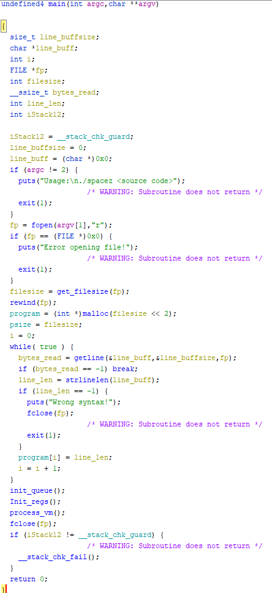
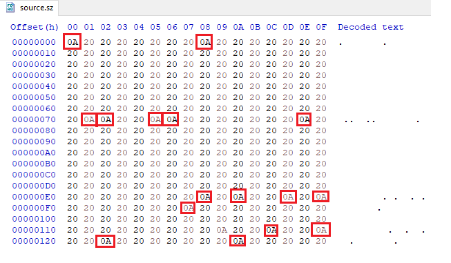

В этой статье будет расмотрен подход к девиртуализации относительно простой виртуальной машины с одного из ctf соревнований.

>Мы разработали новый язык программирования SpaceZ. Нам он кажется очень простым и удобным, но у нас до сих пор нет документации… Однако мы обещаем, что она появится через пару дней (когда наш единственный разработчик, знающий, как это все работает, вернется из отпуска). Но вы все равно можете пока протестировать нашу бета версию :)

В этом задании нам дано 2 файла: исполняемый файл под архитектуру mips и какой-то дополнительный файл.

После быстрого анализа, становится понятным, что исполняемый файл представляет собой виртуальную машину, а дополнительный - байткод для этой вм.

# Анализ

Перед выполнением вм, программа выделяет память под байткод, загружает его и декодирует. Сначала проверяется кол-во аргументов (argc), их должно быть 2.



Затем байткод считывается в память и декодируется.
Закодированный байткод выглядит следующим образом:



Каждый опкод разделен 0x0A символом и длина пробелов считается как номер опкода.

Как выглядит декодированный байткод:


После чего вызывается 2 функции - `init_queue` и `init_regs`. Первая инициализирует глобальную память виртуальной машины, вторая инициализирует регистры.

# Структура VM

Виртуальная машина имеет 4 32-битных регистра и указатель текущей инструкции. Вместо стэка, она использует очередь-подобную (`FIFO`) структуру данных и все операции с памятью выполняются над этой очередью.

|Register|	Purpose|
|--------|---------|
|R0	|General purpose|
|R1	|General purpose|
|R2	|General purpose|
|R3	|General purpose|
|PC	|Program counter|
|SP	|Our Virtual “Queue” pointer, points to the top of the queue|
|QP	|Our Virtual “Queue” pointer, points to the bottom of the queue|

`process_vm` - Функция с большим свитч кейсом, которая в цикле выполняет байткод.

Всего можно насчитать 24 инструкции. Я придумал для них следующие имена:

|Opcode	|Operand count	|Name	|Meaning|
|-------|---------------|-------|-------|
|0	|0	|CLS	|Clear Queue|
|1	|1	|STRD	|Put 4 bytes in Queue|
|2	|1	|STRB	|Put 1 bytes in Queue|
|3	|1	|STRW	|Put 2 bytes in Queue|
|4	|1	|LDRD	|Load 4 bytes from Queue|
|5	|1	|LDRB	|Load 1 bytes from Queue|
|6	|1	|LDRW	|Load 2 bytes from Queue|
|7	|2	|MOV	|RegisterN = Immediate|
|8	|2	|MOV	|RegisterN = RegisterM|
|9	|2	|ADD	|RegisterN += RegisterM|
|10	|2	|SUB	|RegisterN -= RegisterM|
|11	|2	|MUL	|RegisterN *= RegisterM|
|12	|2	|DIV	|RegisterN /= RegisterM|
|13	|2	|MOD	|RegisterN %= RegisterM|
|14	|2	|AND	|RegisterN &= RegisterM|
|15	|2	|OR	|RegisterN \|= RegisterM|
|16	|2	|XOR	|RegisterN ^= RegisterM|
|17	|2	|JMP	|Jump Immediate|
|18	|4	|JE	|Jump Immediate if RegisterN == RegisterM|
|19	|4	|JNE	|Jump Immediate if RegisterN != RegisterM|
|20	|4	|JGE	|Jump Immediate if RegisterN >= RegisterM|
|21	|4	|JL	|Jump Immediate if RegisterN < RegisterM|
|22	|2	|READ_INPUT	|Reads input with size N into Queue|
|23	|2	|PRN	|Prints contents of Queue|
|24	|2	|VMEXIT	|Virtual Exit (end of execution)|

# Дизассемблирование байткода

Поскольку байткод довольно простой, мне не составило труда написать линейный дизассемблер для него.

```python
def disassembler(bytecode):
  pc = 0
  while pc < len(bytecode) - 1:
    print('%02s:\t' % str(pc), end=' ')
    opcode = bytecode[pc]
    if opcode == 0:
      print('cls')
      pc += 1
    elif opcode == 1:
      reg = bytecode[pc + 1]
      print(f'str reg{reg} (4 byte)')
      pc += 2

    elif opcode == 2:
      reg = bytecode[pc + 1]
      print(f'str reg{reg} (1 byte)')
      pc += 2

    elif opcode == 3:
      reg = bytecode[pc + 1]
      print(f'str reg{reg} (2 bytes)')
      pc += 2

    elif opcode == 4:
      reg = bytecode[pc + 1]
      print(f'ldr reg{reg}(4 bytes)')
...
...
...
```


Дизассемблированный код:

```python
 0:      cls
 1:      mov reg0, 104
 4:      str reg0 (1 byte)
 6:      mov reg1, 105
 9:      str reg1 (1 byte)
11:      mov reg2, 33
14:      str reg2 (1 byte)
16:      mov reg0, 10
19:      str reg0 (2 bytes)
21:      call puts(Queue)
22:      call malloc(32)
22:      call scanf("%s", malloc_addr)
24:      ldr reg0 (1 byte)
26:      str reg0 (1 byte)
28:      mov reg2, 1
31:      mov reg1, 6
34:      mul reg1, reg2
37:      add reg1, reg2
40:      xor reg0, reg1
43:      ldr reg1 (1 byte)
45:      xor reg1, reg0
48:      str reg1 (1 byte)
50:      mov reg0, reg1
53:      mov reg1, 1
56:      mov reg3, 32
59:      add reg2, reg1
62:      cmp reg2, reg3
62:      je 67
62:      jmp 31
67:      jmp 92
92:      ldr reg0 (1 byte)
94:      ldr reg0 (1 byte)
96:      mov reg1, 99
99:      cmp reg0, reg1
99:      je 104
99:      jmp 69
104:     ldr reg0 (1 byte)
106:     mov reg1, 16
109:     cmp reg0, reg1
109:     je 114
...
...
```

# Анализ виртуализированной функции

Как можно заметить, первым делом программа загружает `hi!\x00` в очередь и выводит ее на экран (строка 21)

После этого считывается 32 байта в очередь и первый байт из нее загружается в конец. (строка 26)

На данный момент очередь будет выглядеть следующим образом:
Конец -> `[c|}|a|a|a|a|a|a|a|a|a|a|a|a|a|a|a|a|a|a|a|a|a|a|a|a|{|p|u|c|f|t]` <- начало

Должен сказать, что формат флага `ctfcup{`, поэтому первые 7 символов и 1 последний нам известны.

После чего начинается цикл:

```
31:      mov reg1, 6
34:      mul reg1, reg2
37:      add reg1, reg2
40:      xor reg0, reg1
43:      ldr reg1 (1 byte)
45:      xor reg1, reg0
48:      str reg1 (1 byte)
50:      mov reg0, reg1
53:      mov reg1, 1
56:      mov reg3, 32
59:      add reg2, reg1
62:      cmp reg2, reg3
62:      je 67
62:      jmp 31
```


В регистре 2 хранится индекс, а в регистре 0 - последний байт.

Если перевести этот цикл на питон:

```python
one_byte = flag.pop()
for i in range(1, len(flag)):
    t = 6
    t *= i
    t += i
    c = flag.pop()
    one_byte ^= t ^ c
    flag.put(one_byte)
```

После цикла идет посимвольное сравнение с уже заданнами значениями:

```python
94:      ldr reg0 (1 byte)
96:      mov reg1, 99
99:      cmp reg0, reg1
99:      je 104
99:      jmp 69

104:     ldr reg0 (1 byte)
106:     mov reg1, 16
109:     cmp reg0, reg1
109:     je 114
109:     jmp 69

114:     ldr reg0 (1 byte)
116:     mov reg1, 120
119:     cmp reg0, reg1
119:     je 124
119:     jmp 69
```

В случае правильного ввода, пишется `yes!`, в случае неправильного `no!`.

# Решение

Поскольку цикл кодировки флага довольно простой, нам не составит труда получить исходный флаг:

```python
flag = [99, 16, 120, 14, 103, 52, 101, 2, 11, 70, 116, 108, 89, 78, 29, 46, 106, 105, 38, 147, 113, 189, 75, 166, 58, 251, 42, 226, 18, 190, 9, 173]

known = [ord(i) for i in 'ctfcup{']
last_byte = known[0]
out = ''
for i in range(1, len(flag)):
  for j in range(32, 127):
    t = 6
    t *= i
    t += i
    if last_byte ^ t ^ j == flag[i]:
      out += chr(j)
      last_byte = last_byte ^ t ^ j
      break
    
print(out)
```

`ctfcup{V1rtUaL1Z4t10n_lL4ngu4ge}`

Во второй части мы придумаем псевдоязык для этой вм, опишем его в miasm и поднимим в `miasm IR` для последующего эмулирования и оптимизации.

---

Конец.