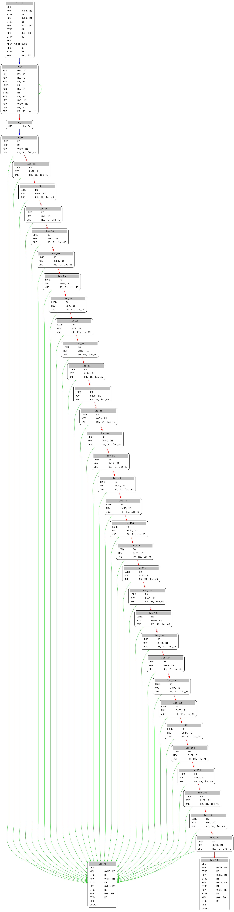
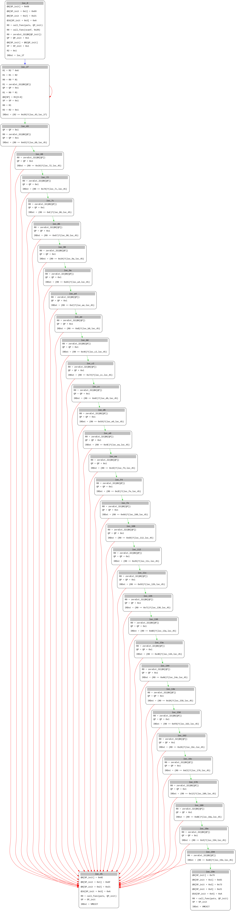

В этой части мы опишем байткод из предыдущей статьи в наш псевдоязык, затем поднимим его в `miasm IR` для дальнейшей оптимизации и эмуляции.

Поскольку в miasm отсутствует документация по написанию кастомных архитектур, эта статья должна послужить отличным примером для этого(хоть и некоторые аспекты были до конца не поняты).

Для начала стоит поговорить как инструкции кодируются в байткоде `spacezVM`.

# Описание байткода

* Максимальная длина инструкции 5 байт
* первый байт всегда номер опкода
* Cледующие байты, если они есть - аргументы

Пример (все инструкции далее будут в хексе):

```
Инструкция 076800
Описание: Загрузить константу в регистр
Псевдокод: mov 0x68, r0

07 - опкод
68 - значение
00 - номер регистра (может быть от 0 до 3)
```

```
Инструкция 100002
Описание: Исключающее ИЛИ двух регистров
Псевдокод: xor r0, r2

10 - опкод
00 - номер регистра
02 - номер регистра (куда положить значение)
```

Можно заметить, что в отличие от `x86` ассемблера, здесь операнд назначения всегда последний.

Более сложный пример:

```
Инструкция 1200000132
Описание: Условный прыжок, если значения регистров равны
Псевдокод: je 0x32, R0, R1

12 - опкод
00 - код условного типа (=, !=, >=, <)
00 - регистр сравнения
01 - регистр сравнения
32 - адрес прыжка, при выполнении условия
```

Все остальные инструкции, мы описали в предыдущей статье. Далее я покажу как представить эти инструкции в miasm.

# Минимальные требования

Для описания любой архитектуры, нам необходимо создать следующие файлы:

* regs.py - описание регистров процессора
* ira.py - должен содержать класс промежуточного представления, необходим для работы miasm IR
* disasm.py - должен содержать класс дизассемблирования, необходим для работы miasm Machine
* arch.py - описание самой архитектуры (размер регистров, набор инструкций, ABI и.т.д.)
* sem.py - описание промежуточного представления, как каждая инструкция процессора должна выглядеть в miasm IR
* jit.py - должен содержать класс эмулятора, необходим для работы miasm Jitter

# regs.py

Весь код выглядит так:

```python
from miasm.expression.expression import ExprId
from miasm.core.cpu import gen_regs

# Used by internal miasm exceptions
exception_flags = ExprId("exception_flags", 32)
exception_flags_init = ExprId("exception_flags_init", 32)

# General-purpose registers (R0 - R3) names
gpr_names = ["R%d" % r for r in range(4)]  # register names
gpr_exprs, gpr_inits, gpr_infos = gen_regs(gpr_names, globals())  # sz=32 bits (default)
# PC SP QP
csr_names = ["PC", "SP", "QP"]
csr_exprs, csr_inits, csr_infos = gen_regs(csr_names, globals())

PC = csr_exprs[0]
SP = csr_exprs[1]
QP = csr_exprs[2]

# Set registers initial values
all_regs_ids = gpr_exprs + csr_exprs + [exception_flags]
all_regs_ids_init = gpr_inits + csr_inits + [exception_flags_init]
all_regs_ids_no_alias = all_regs_ids[:]
all_regs_ids_byname = dict([(x.name, x) for x in all_regs_ids])

regs_init = dict()  # mandatory name
for i, r in enumerate(all_regs_ids):
  regs_init[r] = all_regs_ids_init[i]
```

`exception_flags` и `exception_flags_init` нужны даже если у нас нет исключений. Они необходимы для работы miasm `Jitter`.

У нас будет 4 32-битных регистра с именами R0, R1, R2, R3.

```python
gpr_names = ["R%d" % r for r in range(4)]  # register names
gpr_exprs, gpr_inits, gpr_infos = gen_regs(gpr_names, globals())
```

`gpr_exprs` - ExprId с именами этих регистров
`gpr_exprs_inits` - ExprId с именами+`_init` этих регистров

Далее тоже самое делаем для специальных регистров:
`SP` - указывает на конец очереди
`QP` - указывает на начало очереди
`PC` - счетчик инструкций

`all_regs_ids`, `all_regs_ids_init` список всех регистров и список всех init регистров соотвественно.

`all_regs_ids_no_alias` - список всех регистров, не имеющих `alias`. Например этот список будет содержать `EAX EBX ECX EDX`, но не `AH AL BH BL` и т.д. Поскольку у нас все регистры 32-битные и разбивать их на более мелкие мы не будем, то просто указываем `all_regs_ids`.

# arch.py

Как уже упоминалось, в этом файле хранится логика процессора, его инструкции и аргументы.
Все классы, которые нам будут нужны:

```python
class instruction_spacez(instruction): # Этот класс нужен для создания миасм инструкций
class spacez_additional_info(object):  # Нужен, но до конца не понят
class mn_spacez(cls_mn):               # Этот класс представляет собой miasm Machine и необходим для работы дизассемблера
class spacez_arg(m_arg):               # Аргумент инструкции (регистр или число)
class spacez_reg(reg_noarg, spacez_arg): # Описание регистра
class spacez_imm(imm_noarg, spacez_arg): # Описание константы
```

Из всех этих классов самым важным является `instruction_spacez`. Правильное назначение инструкций, которые останавливают базовый блок, является главным для корректной работы дизассемблера.

Тут мы создаем мнемоники инструкций, вот как это выглядит:

```python
reg   = bs(l=8,  cls=(spacez_reg, ))
imm8  = bs(l=8,  cls=(spacez_imm, spacez_arg))

# mnemonics
addop("CLS", [bs("00000000")])
addop("STRD", [bs("00000001"), reg])
addop("STRB", [bs("00000010"), reg])
addop("STRW", [bs("00000011"), reg])
addop("LDRD", [bs("00000100"), reg])
addop("LDRB", [bs("00000101"), reg])
addop("LDRW", [bs("00000110"), reg])
addop("MOV", [bs("00000111"), imm8, reg])
addop("MOV", [bs("00001000"), reg, reg])
addop("ADD", [bs("00001001"), reg, reg])
addop("SUB", [bs("00001010"), reg, reg])
addop("MUL", [bs("00001011"), reg, reg])
addop("DIV", [bs("00001100"), reg, reg])
addop("MOD", [bs("00001101"), reg, reg])
addop("AND", [bs("00001110"), reg, reg])
addop("OR",  [bs("00001111"), reg, reg])
addop("XOR", [bs("00010000"), reg, reg])
addop("JMP", [bs("00010001"), imm8])
addop("JE",  [bs("00010010"), bs("00000000"), reg, reg, imm8])
addop("JNE", [bs("00010010"), bs("00000001"), reg, reg, imm8])
addop("JGE", [bs("00010010"), bs("00000010"), reg, reg, imm8])
addop("JL",  [bs("00010010"), bs("00000011"), reg, reg, imm8])
addop("VMEXIT", [bs("00010101")])
addop("PRN", [bs("00010100")])
addop("READ_INPUT", [bs("00010011"), imm8])
```

# disasm.py

Тут объяснять в принципе нечего, мы просто наследуемся от базового класса:

```python
from miasm.core.asmblock import disasmEngine
from miasm.arch.spacez.arch import mn_spacez


class dis_spacez(disasmEngine):
  """Spacez miasm disassembly engine
      Notes:
          - its is mandatory to call the miasm Machine
  """
  def __init__(self, bs=None, **kwargs):
    super(dis_spacez, self).__init__(mn_spacez, None, bs, **kwargs)
```

# sem.py

В этом файле лежит описание всех инструкций на языке miasm IR. Все что нам нужно - описать каждую инструкцию.

Для начала создадим класс, который будет создавать `IR`:

```python
class ir_spacez(IntermediateRepresentation):
  """Spacez miasm IR
     It transforms an instructon into an IR.
  """
  addrsize = 32

  def __init__(self, loc_db=None):
    IntermediateRepresentation.__init__(self, mn_spacez, None, loc_db)
    self.pc = mn_spacez.getpc()
    self.sp = mn_spacez.getsp()
    self.qp = mn_spacez.getqp()
    self.IRDst = ExprId("IRDst", 32)

  def get_ir(self, instr):
    """Get the IR from a miasm instruction."""
    args = instr.args
    instr_ir, extra_ir = mnemo_func[instr.name](self, instr, *args)
    return instr_ir, extra_ir
```

`mnemo_func` - словарь имен инструкций и функций, которые обрабатывают ту или иную инструкцию:

```python
mnemo_func = {
    "MOV": mov,
    "ADD": add,
    "SUB": sub,
    "MUL": mul,
    "DIV": div,
    "MOD": mod,
    "AND": v_and,
    "OR": v_or,
    "XOR": xor,
    "JMP": jmp,
    "JE": je,
    "JNE": jne,
    "JGE": jge,
    "JL": jl,
    "STR": v_str,
    "STRB": v_strb,
    "STRW": v_strw,
    "CLS": cls,
    "VMEXIT": vmexit,
    "PRN" : prn,
    "READ_INPUT": read_input,
    "LDR": ldr,
    "LDRB": ldrb,
    "LDRW": ldrw,
}
```

Вот пример некоторых функций:

```python
def xor(_, instr, reg1, reg2):
  result = reg1 ^ reg2
  e = [ExprAssign(reg2, result)]
  return e, []

def jmp(ir, instr, imm):
  if imm.is_loc():
    imm = loc_key_bitness(imm, 32)
  e = []
  e += [ExprAssign(PC, imm)]
  e += [ExprAssign(ir.IRDst, imm)]
  return e, []

def read_input(ir, instr, imm):
  e = []
  imm = ExprInt(int(imm), ir.sp.size)
  e += ir.call_effects(ExprId("scanf", 32), imm)
  return e, []
```

# ira.py

Как я уже упоминалось выше, `ira.py` нужен для работы движка miasm IR. К счастью для нас, все что нам нужно сделать - наследоваться от базового класса. Вот как это будет выглядеть:

```python
from miasm.ir.analysis import ira
from miasm.arch.spacez.sem import ir_spacez
from miasm.expression.expression import *

class ir_a_spacez_base(ir_spacez, ira):

  def __init__(self, loc_db):
    ir_spacez.__init__(self, loc_db)
    self.ret_reg = self.arch.regs.R0

  def call_effects(self, addr, *args):
    call_assignblk = [
            ExprAssign(self.ret_reg, ExprOp('call_func', addr, *args)),
    ]
    return call_assignblk

class ir_a_spacez(ir_a_spacez_base):

  def __init__(self, loc_db):
      ir_a_spacez_base.__init__(self, loc_db)

  def get_out_regs(self, _):
      return set([self.ret_reg, self.sp])
```

В базовом классе я перезаписал метод `call_effects`, который порождает expressions при вызове функций. У нас байткод вызывает всего несколько функций: `scanf` и `puts` и все они находятся в обработчиках опкодов, поэтому в нашем случае этот метод служит лишь для визуального представления в ir.

# Дизассемблирование байткода

И вот что у нас получилось в итоге:



С этим графом можно работать, находить вершины, циклы, анализировать каждую инструкцию и.т.д. и.т.п.

Вот как будет выглядеть miasm IR:



Теперь у нас есть возможность символьно выполнять байткод, оптимизировать и если сильно постараться - перевести в llvm и перекомпилировать в `x86` :).

---

Конец.

