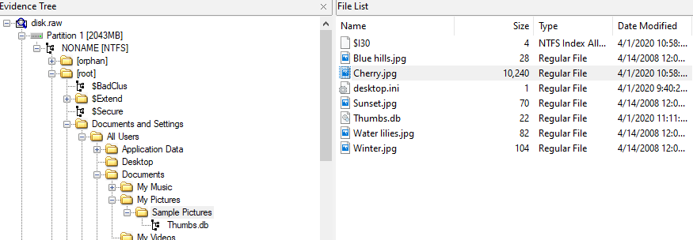
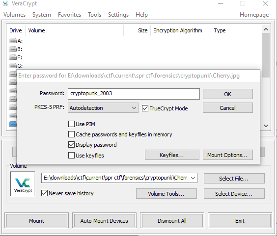

# Оглавление
1. [Crypto](#Crypto)
2. [Forensics](#Forensics)
3. [Reverse](#Reverse)

# Crypto

## ЫХЫХ (24 solves)

>Ту та ту та
>Ту та ти та
>Ту та ту та ти
>Ти ту та ти
>Ти ту та ти
>Ти ту та ти ти ту та

Само задание

```
>>> e, n = (3, 1790707753365795418841729699379193276395981524363782327873718589639655966058578374254964039644910359346857311359948708984278578450069871685344678652553655035251602806563637363071753327728754995053415389279785107516999221971781597724733184279534477239566789173532366357270583106789)
>>> cipher1 = pow(m, e, n)
>>> cipher 
795862536308653135874540839924225726099126658589105843566005771752019567375004962111691552978894566581532312767298507001955367078235777348684167307965810921018165590028105653181514262975804202902418165084166926390342660653070816216285194018133709545730142577971033014247131552285
>>> e, n = (3, 30502351862940031577691995198949664002982179597487683486715266186733160876943419156362946151249328917515864630224371171221716993844781534383325603218163254920110064990807393285889718524383600251199650576597076902947432221039432760575157628357292075495937664206199565578681309135044121854119)
>>> cipher2 = pow(m, e, n)
>>> cipher2
21228916091898763326575652926726074032480106510587709805041548098929463016430536696939169699057743107452718249623926449518427859379626018832642978700714030638918717511678813064274535728944067038972105730817607329399519019570738190717105231499275028584317014144027072724684739452902678522226
>>> e, n = (3, 276931556780344213902868906164723309223760836398395325400503672280937582471494739461900602187562551243171865731050750745462388288171212746300721613469564396741836389979086904304472476001839015983033451909174663464663867829125664459895575157178816900228792711267471958357574416714366499722090015674047)
>>> cipher3 = pow(m, e, n)
>>> cipher3
37664215472082696505657907745457909139463329957842786032526205741425125895678520348835474079776764441832710935799599147566697404577127018335990932516193582574220706458333476428969795111815943027997683976375981685156455766761221234041114624824474093657373295700512194761008010138972438070761325518105
```

Видно, что три раза одно и тоже сообщение шифруют с маленьким публичным ключом.
На лицо типичная `Hastad’s Broadcast Attack`.

### Решение:

```python
import gmpy

e = 3

n1 = 1790707753365795418841729699379193276395981524363782327873718589639655966058578374254964039644910359346857311359948708984278578450069871685344678652553655035251602806563637363071753327728754995053415389279785107516999221971781597724733184279534477239566789173532366357270583106789
n2 = 30502351862940031577691995198949664002982179597487683486715266186733160876943419156362946151249328917515864630224371171221716993844781534383325603218163254920110064990807393285889718524383600251199650576597076902947432221039432760575157628357292075495937664206199565578681309135044121854119
n3 = 276931556780344213902868906164723309223760836398395325400503672280937582471494739461900602187562551243171865731050750745462388288171212746300721613469564396741836389979086904304472476001839015983033451909174663464663867829125664459895575157178816900228792711267471958357574416714366499722090015674047

c1 = 795862536308653135874540839924225726099126658589105843566005771752019567375004962111691552978894566581532312767298507001955367078235777348684167307965810921018165590028105653181514262975804202902418165084166926390342660653070816216285194018133709545730142577971033014247131552285
c2 = 21228916091898763326575652926726074032480106510587709805041548098929463016430536696939169699057743107452718249623926449518427859379626018832642978700714030638918717511678813064274535728944067038972105730817607329399519019570738190717105231499275028584317014144027072724684739452902678522226
c3 = 37664215472082696505657907745457909139463329957842786032526205741425125895678520348835474079776764441832710935799599147566697404577127018335990932516193582574220706458333476428969795111815943027997683976375981685156455766761221234041114624824474093657373295700512194761008010138972438070761325518105

N = n1*n2*n3
N1 = N/n1
N2 = N/n2
N3 = N/n3

u1 = gmpy.invert(N1, n1)
u2 = gmpy.invert(N2, n2)
u3 = gmpy.invert(N3, n3)

M = (c1*u1*N1 + c2*u2*N2 + c3*u3*N3) % N

m = gmpy.root(M,e)[0]

print(hex(m)[2:].rstrip("L").decode("hex"))
```

`SPR{pon_PhuX0R1n9_r54_80y_is_to_extend_the_flag_pon}`

---

## Should have seen this coming (16 solves)

>nc tasks.sprush.rocks 1666
>
>You will need this solver.py (Feel free to implement your own solver)
>
>Author: ne_bknn

В таске нам предлагается решить 50 рса за минуту. Поскольку `n` довольно маленький, `sympy.factorint` вполне справляется с этой задачей.

Код:

```python
import sympy
import sys
from pwn import *
import hashlib
from string import printable
from itertools import product
import re

def solve_captcha(s):
    if isinstance(s, bytes):
        s = s.decode("utf-8")

    s = s.strip()
    s = s.split(":")
    brute_len, difficulty, salt, needed_digest = int(s[0]), int(s[1]), s[2], s[3]
    alphabet = printable[:-4].replace(":", "").replace(" ", "").replace("\t", "")
    for combination in product(*([alphabet]*brute_len)):
        guess = salt+"".join(combination)
        digest = hashlib.md5(bytes(guess, encoding='utf-8')).digest().hex()
        if digest[difficulty:] == needed_digest:
            return guess


def get_primes(n):
    t = sympy.factorint(n)
    return t.keys()

def main():
    r = remote('tasks.sprush.rocks', 1666)
    # capcha
    o = r.recvline()
    r.sendline(solve_captcha(o))
    r.recvline()
    r.sendline('ok')
    
    while True:
        message = r.recv(1024)
        print(message)
        n = int(re.findall(b'n: (\d+)\n', message)[0].decode())
        e = int(re.findall(b'e: (\d+)\n', message)[0].decode())
        c = int(re.findall(b'c: (\d+)\n', message)[0].decode())

        p, q  = get_primes(n)
        print(p, q)
        phi = (int(p)-1) * (int(q)-1)
        d = sympy.mod_inverse(e, phi)
        m = pow(c, d, n)
        r.sendline(str(m))


if __name__ == "__main__":
    main()
```

Ответ с сервака:

```
b'n: 8848830971127661721\ne: 65537\nc: 8719180513613632261\nm: '
2339368151 3782573071
b'n: 12883773403413332789\ne: 65537\nc: 11526597996173669202\nm: '
3301255351 3902689139
b'n: 11949252817517292737\ne: 65537\nc: 1478256834308447505\nm: '
2864207113 4171923449
b'n: 13333970525034607939\ne: 65537\nc: 2190166559806512375\nm: '
3210025571 4153851809
b'n: 10676411479007547389\ne: 65537\nc: 10416489339649233506\nm: '
2648620027 4030933607
b'n: 10680624062878190899\ne: 65537\nc: 7661653595800700477\nm: '
2490324619 4288848121
b'n: 13682446319165256169\ne: 65537\nc: 11717137267804899133\nm: '
3281886241 4169080009
b'n: 11114032983513340849\ne: 65537\nc: 10533283480817097298\nm: '
3369504637 3298417477
b'n: 10187134487898930031\ne: 65537\nc: 173109306986430892\nm: '
2601661661 3915626171
b'n: 15318441457018414469\ne: 65537\nc: 11195309962436008188\nm: '
4278525607 3580308467
b'n: 11493151306558290613\ne: 65537\nc: 3642323765165979211\nm: '
2706892187 4245884399
b'\nSPR{sympy_has_great_factor_func_btw}\n'
```

---

## MALLEficent (10 solves)

>nc tasks.sprush.rocks 1777
>
>You will need this solver.py (Feel free to implement your own solver)
>
>Author: ne_bknn

В этом таске нам дан сервис, который может расшифровать любое наше сообщение, кроме сообщение с флагом.

```
Your encrypted flag: 42543425501559210987654346977013993124927887435578961371065648018927637410040745322584674791665642644288255333951313892066780486391762095980765665298836438981640069974342268209246746590143593478980136336865148881666702401109626002804293779523705366633269084724080095939916907093930374305243033158484674405376 
n: 89462094970883567595728502930861854816001316587216252476746721676179986975182531917960559575488256813264178919464347747676584843989641803333840477798270795265850305973285996020970573310417302547493001417914965852464722170993535744721810270347287166235898515368472149670549735151218198903176248472613976695987 
e: 65537
You can decrypt everything except flag!
ciphertext >
```

Наша задача сделать такой шифротекст, который при дешифровке даст флаг.

Вот как это должно выглядеть:

1. шифруем двойку публичным ключом:
`c2 = pow(2, e, n)`
2. Отправляем наш шифротекст перемноженный с шифротекстом флага:
`c3 = (c1 * c2) % n = pow(flag, e, n) * pow(2, e, n)`

В ответ приходит:

```
Decrypted message: 5971249687054162835985552124424236292655834125614752706716683213901489372060203225954364281399435373103866
```

Поскольку расшифрованное сообщение это 2 * flag, достаточно поделить его на 2 и получить флаг:

```python
m = 5971249687054162835985552124424236292655834125614752706716683213901489372060203225954364281399435373103866
print(binascii.unhexlify(hex(m//2)[2:]))
```

`SPR{did_you_know_that_even_otp_is_malleable}`

---

# Forensics

## Forensics 101 (49 solves)

>Не открывается…
>
>photo2.png
>
>Автор: @ne_bknn

Тут нам дана png фотка без заголовка. То, что это png фотка можно было определить по `IHDR` строчке в дампе.

Для решения нужно было открыть любую пнг фотку и скопировать оттуда удаленные байты.


---

## Cryptopunk (20 solves)

>Тут это, такое дело… Контора приняла одного парня, так он оказался повернут на крипте, все шифрует. Опера сделать ничего не смогли, а штатный криминалист он.. кхм, не будем о нем. Может расковыряешь, а?
>
>Диск
>
>Память
>
>Автор: @ne_bknn

В этом таске нам дан дамп оперативки и образ системы.

Для начала давайте определим ос:

```
$ volatility -f mem.raw imageinfo
Volatility Foundation Volatility Framework 2.6
INFO    : volatility.debug    : Determining profile based on KDBG search...
          Suggested Profile(s) : WinXPSP2x86, WinXPSP3x86 (Instantiated with WinXPSP2x86)
```

Теперь давайте посмотрим какие процессы запущены:

```
$ volatility -f mem.raw --profile=WinXPSP2x86 pslist
Volatility Foundation Volatility Framework 2.6
Offset(V)  Name                    PID   PPID   Thds     Hnds   Sess  Wow64 Start                          Exit
---------- -------------------- ------ ------ ------ -------- ------ ------ ------------------------------ ------------------------------
0x80eec020 System                    4      0     51      231 ------      0
0xffbc2ad8 smss.exe                244      4      3 -------- ------      0 2020-04-01 21:41:57 UTC+0000
0xffb87da0 csrss.exe               384    244     10      374      0      0 2020-04-01 21:41:57 UTC+0000
0xffb89da0 winlogon.exe            408    244     19      606      0      0 2020-04-01 21:41:57 UTC+0000
0xffb628d8 services.exe            452    408     16      245      0      0 2020-04-01 21:41:57 UTC+0000
0xffb5c688 lsass.exe               464    408     15      284      0      0 2020-04-01 21:41:57 UTC+0000
0xffb37da0 svchost.exe             640    452     18      195      0      0 2020-04-01 21:41:58 UTC+0000
0xffb25348 svchost.exe             704    452     11      231      0      0 2020-04-01 21:41:58 UTC+0000
0xffb1d228 svchost.exe             744    452     70     1496      0      0 2020-04-01 21:41:58 UTC+0000
0xffaf6d08 svchost.exe             944    452      6       86      0      0 2020-04-01 21:42:17 UTC+0000
0xffaec020 svchost.exe            1024    452     14      197      0      0 2020-04-01 21:42:17 UTC+0000
0xffadb6e0 spoolsv.exe            1104    452     11      119      0      0 2020-04-01 21:42:18 UTC+0000
0xffa8a020 alg.exe                1464    452      6      106      0      0 2020-04-01 21:42:21 UTC+0000
0xff967568 explorer.exe            700   1652     17      572      0      0 2020-04-01 21:43:01 UTC+0000
0xff938498 wscntfy.exe            2040    744      1       28      0      0 2020-04-01 21:43:01 UTC+0000
0xff934da0 TrueCrypt.exe           684    700      2      118      0      0 2020-04-01 10:55:43 UTC+0000
0xff92d908 firefox.exe             620    700     65      774      0      0 2020-04-01 11:03:12 UTC+0000
```

2 процесса бросаются в глаза - `firefox` и `truecrypt`

Начнем с трукрипта. Плагином `truecryptsummary` выведем подробную инфу о нем:

```
$ volatility -f mem.raw --profile=WinXPSP2x86  truecryptsummary
Volatility Foundation Volatility Framework 2.6
Password             big wallet rat chinese router at offset 0xf9549064
Process              TrueCrypt.exe at 0xff934da0 pid 684
WARNING : volatility.debug    : NoneObject as string: Pointer ServiceName invalid
Kernel Module        truecrypt.sys at 0xf9515000 - 0xf954c000
Symbolic Link        Y: -> \Device\TrueCryptVolumeY mounted 2020-04-01 11:03:08 UTC+0000
Symbolic Link        Y: -> \Device\TrueCryptVolumeY mounted 2020-04-01 11:03:08 UTC+0000
Symbolic Link        Volume{c23d128d-7461-11ea-a02f-080027d21ec7} -> \Device\TrueCryptVolumeY mounted 2020-04-01 11:00:30 UTC+0000
Symbolic Link        Volume{c23d128a-7461-11ea-a02f-080027d21ec7} -> \Device\TrueCryptVolumeZ mounted 2020-04-01 10:58:07 UTC+0000
Driver               \Driver\truecrypt at 0x7983a48 range 0xf9515000 - 0xf954bb80
Device               TrueCryptVolumeY at 0xff8e2830 type FILE_DEVICE_DISK
Container            Path: \??\C:\Documents and Settings\All Users\Documents\My Pictures\Sample Pictures\Cherry.jpg
Device               TrueCrypt at 0xff8cbd70 type FILE_DEVICE_UNKNOWN
```

Сразу находим пароль `big wallet rat chinese router` и локацию контейнера `\??\C:\Documents and Settings\All Users\Documents\My Pictures\Sample Pictures\Cherry.jpg`.

Теперь, с помощью `FTK Imager` достаем контейнер из файловой системы.



Подрубаем веракрипт, вводим пароль и получаем флаг. (Не забудьте поставить TrueCrypt Mode для этого)

`SPR{lets_play_wild_volatile}`

---

## Cryptopunk: Hidden (5 solves)

>Всегда удивлялся, как у вас это получается. Ну, эт самое, ты понял. Начальство сказало, что этого недостаточно, должно быть что-то еще. Постарайся уж найти, сам понимаешь…
>
>Автор: @ne_bknn

Если полазить в файловой системе диска, то, в принципе, кроме файрфокса там ничего и нет.

В этом таске нужно найти пароль из базы файрфокса и им открыть `hidden volume` в том-же трукрипт контейнере.

Для этого дампим папку с firefox профилями и с помощью [firefox_decrypt](https://github.com/unode/firefox_decrypt) получаем логины пароли:

```
$ firefox_decrypt/firefox_decrypt.py Firefox/

Master Password for profile Firefox/Profiles/nfxa417d.default:
2020-04-09 12:22:16,348 - WARNING - Attempting decryption with no Master Password

Website:   https://crypto-kids20.forkbomb.ru
Username: 'cryptopunk'
Password: 'cryptopunk_2003'
```

Пароль `cryptopunk_2003` открывает hidden volume в трукрипт контейнере и мы получаем второй флаг.



`SPR{do_not_reuse_passwds_bro}`

---

# Reverse

## Crack me and Go away (13 solves)

>Go go go!
>crackme
>Автор: @alexstar_46

Дан бинарь на гоу, в `main.main` находится простой алгоритм проверки ключа:

```c++
fmt_Scanf(ab, *(error_0 *)&v2, v3, v4);
if ( _input->len == 30LL )
{
i = 0LL;
check = 0LL;
while ( i < 30 )
{
  if ( i >= 30 )
    runtime_panicindex();
  if ( i * i + (key[i] ^ _input->str[i]) + 11 == flag[i] )
    v8 = check;
  else
    v8 = check + 1;
  check = v8;
  i++;
}
if ( check )
{                    // badboy
  v19.cap = (__int64)&r3;
  v20 = &main_statictmp_3;
  a.array = (interface_{} *)&v19.cap;
}
else
{                    // goodboy
  v21.array = (interface_{} *)&r3;
  v21.len = (__int64)&main_statictmp_2;
  a.array = (interface_{} *)&v21;
}
a.len = 1LL;
a.cap = 1LL;
fmt_Println(a, *(error_0 *)&v2, i);
}
```

Дампим массив ключей и массив флага и пишем брутфорс:

```python
key = [0x43, 0x5c, 0x7c, 0x4e, 0x14, 0x52, 0x2f, 0x3d, 0x15, 0x58, 0x4c, 0x3f, 0x36, 0x55, 0x58, 0x10, 0xc, 0x2c, 0x47, 0x5c, 0x4b, 0x35, 0x2c, 0xd, 0x60, 0x5d, 0x36, 0x2a, 0xb, 0x9]
check = [0x1b, 0x18, 0x3d, 0x49, 0x6e, 0x61, 0x9f, 0x8b, 0x71, 0x8a, 0xee, 0xd1, 0x9e, 0x11a, 0xd6, 0x10d, 0x144, 0x19f, 0x180, 0x1e3, 0x1d4, 0x210, 0x262, 0x29a, 0x29c, 0x2ac, 0x2f5, 0x32a, 0x353, 0x3c8]

out = ''
for i in range(len(key)):
    for k in range(32, 127):
        if (i * i + (key[i] ^ k)) + 11 == check[i]:
            out += chr(k)
            break
print(out)
```

`SPR{Go_r3v3r53_15_v3ry_s1mpl3}`

---

## Plaintext (7 solves)

>I tried to make reverse task, where flag is already given. This should be pretty easy. Download here
>
>Task updated, please, re-download
>
>Note: flag is in SPR{.*} format. Binary verifies flag without SPR{}
>Author: @KuriGohanAndKamehameha

Очень простой таск, но почему-то так мало решений.

Дано 2 файла, `blob` - 16 мегабайт и статично линкованный бинарь.

Проблема была в опредении, что делает функция, в которую подается массив из `blob`, наш ввод и длина 0x1c:

```c++
if ( v5 == 100459 )
{
  v3 = (__int64)_input;
  blob = qword_4AD3E0 + v15;
  if ( !(unsigned int)sub_401078((__int64)_input, blob, size) )
    check_1 = 1;
}
```

Так вот, это обычная strncmp :)

Поэтому для решения нужно в дебагере дойти до этого места, сдампить второй аргумент и он будет флагом. ¯\\(ツ)/¯

---

Конец.
